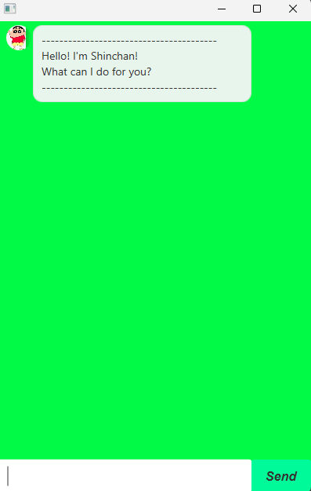

# ShinChan User Guide

ShinChan is a simple yet powerful task management chatbot that helps you keep track of your todos, deadlines, and events.

You interact with ShinChan using text commands. Tasks are automatically saved to disk, so your data persists across sessions.

## Adding deadlines

Adds a deadline task with a specified due date and time. The task will
be stored and displayed in the task list with its due date clearly
formatted.

Example: `deadline DESCRIPTION /by yyyy-MM-dd HHmm`

Example usage:

    deadline submit report /by 2026-03-20 1800

A confirmation message will be shown and the task will be added to the
list.

    Got it. I've added this task:
    [D][ ] submit report (by: Mar 20 2026, 6:00PM)
    Now you have 1 tasks in the list.

------------------------------------------------------------------------

## Adding todos

Adds a simple task without date or time.

Example: `todo DESCRIPTION`

Example usage:

    todo finish homework

A confirmation message will be shown and the task will be added to the
list.

    Got it. I've added this task:
    [T][ ] finish homework
    Now you have 2 tasks in the list.

------------------------------------------------------------------------

## Adding events

Adds an event task with a start and end date/time.

Example: `event DESCRIPTION /from yyyy-MM-dd HHmm /to yyyy-MM-dd HHmm`

Example usage:

    event team meeting /from 2026-03-21 1400 /to 2026-03-21 1600

A confirmation message will be shown and the task will be added to the
list.

    Got it. I've added this task:
    [E][ ] team meeting (from: Mar 21 2026, 2:00PM to: Mar 21 2026, 4:00PM)
    Now you have 3 tasks in the list.

------------------------------------------------------------------------

## Listing tasks

Displays all tasks currently stored.

Example: `list`

Example usage:

    list

All tasks will be displayed in numbered order.

    Here are the tasks in your list:
    1. [T][ ] finish homework
    2. [D][ ] submit report (by: Mar 20 2026, 6:00PM)
    3. [E][ ] team meeting (from: Mar 21 2026, 2:00PM to: Mar 21 2026, 4:00PM)

------------------------------------------------------------------------

## Marking tasks

Marks a task as completed.

Example: `mark TASK_NUMBER`

Example usage:

    mark 1

A confirmation message will be shown and the task will be marked as
done.

    Nice! I've marked this task as done:
    [T][X] finish homework

------------------------------------------------------------------------

## Unmarking tasks

Marks a completed task as not done.

Example: `unmark TASK_NUMBER`

Example usage:

    unmark 1

A confirmation message will be shown and the task will be marked as not
done.

    OK, I've marked this task as not done yet:
    [T][ ] finish homework

------------------------------------------------------------------------

## Deleting tasks

Removes a task from the list.

Example: `delete TASK_NUMBER`

Example usage:

    delete 2

A confirmation message will be shown and the task will be removed from
the list.

    Noted. I've removed this task:
    [D][ ] submit report (by: Mar 20 2026, 6:00PM)
    Now you have 2 tasks in the list.

------------------------------------------------------------------------

## Finding tasks

Searches for tasks containing a keyword.

Example: `find KEYWORD`

Example usage:

    find report

Matching tasks will be displayed.

    Here are the matching tasks in your list:
    1. [D][ ] submit report (by: Mar 20 2026, 6:00PM)

------------------------------------------------------------------------

## Viewing tasks on a specific date

Displays deadlines and events occurring on a particular date.

Example: `on yyyy-MM-dd`

Example usage:

    on 2026-03-21

All deadlines and events on that date will be displayed.

    Here are the tasks on 2026-03-21:
    1. [E][ ] team meeting (from: Mar 21 2026, 2:00PM to: Mar 21 2026, 4:00PM)

------------------------------------------------------------------------

## Exiting ShinChan

Closes the application.

Example: `bye`

Example usage:

    bye

---

## Error handling

If an invalid command is entered, ShinChan will display an appropriate error message.  
Examples include:

- Empty input
- Invalid task number
- Incorrect date/time format
- Missing required arguments
- Unknown command

Error messages are highlighted in the GUI to help users identify issues quickly.